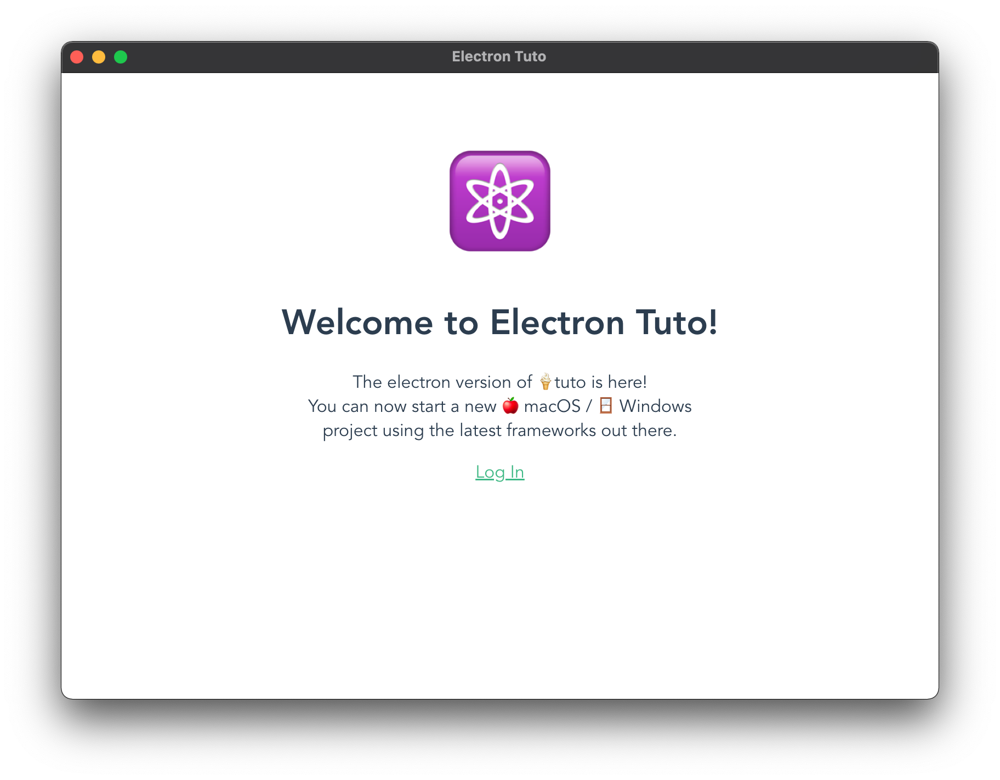

# ⚛️ Electron Tuto

 

 
   

 

## 💎 Features
- Based on [tuto](https://github.com/morellexf26/tuto.git) boilerplate.
- Latest Electron version (v19.x).

 

## 🏁 Start
Create your project directly from GitHub based on electron-tuto boilerplate right now:

 

## 🧱 Development

 

## 🏃🏼‍♂️ Run

In browser
1. `npm install`
2. `npm run build`
3. `npm run dev`

Desktop
1. `npm install`
2. `npm run start`

 

## 🧪 Run tests

1. `npm run test`